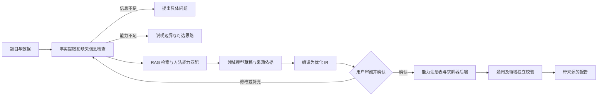

# 运筹优化数学建模 Agent 升级设计（评审稿）

## 目标与范围

用户给出自然语言问题和必要数据后，系统应能说明建模思路，形成可审阅的优化模型，求解，并报告模型与结果分别经过了哪些检验。本设计聚焦现有优化问题族：排班、连续/混合整数线性规划、单商品整数最小费用流和电工杯能源园区 MILP。首期统一建模和运行框架，不增加新的求解问题族；非线性、随机优化等仍明确标记为未支持。

用户选择建立求解器中立 IR、保留领域适配器和专用校验器，并采用 LangChain 与 RAG 增强框架。DeepSeek 负责理解与建议；RAG 提供带来源的运筹知识；Python 核心服务管理模型草稿、确认、求解和校验；LangChain 负责可替换的 Agent 编排；OR-Tools 后端负责数值计算。

## 当前基线

- `analysis_agent.py` 使用固定结构的 `ProblemAnalysis` 返回状态、子任务及领域草稿；调度、LP/MILP、网络流和能源园区目前使用不同的数据结构。
- `models.py` 已有 `LinearProgramProblem`，但排班和最小费用流还没有编译到统一的求解器中立 IR；变量上下界、单位和原文依据也未形成统一契约。
- `retriever.py` 从三层 HMML 方法库按关键词给候选方法打分；当前没有语义检索、知识片段来源定位或检索质量评测。
- `cli.py` 的 `--request` 已返回待审阅草稿，`--solve-draft` 将 CLI 调用作为确认并调用求解；两个入口尚未共享统一应用服务，也没有用草稿摘要绑定确认版本。
- `agent.py`、`linear_agent.py` 和 `min_cost_flow_agent.py` 分别编排方法检索、求解及独立结果校验；`evals.py` 又保留一套领域分流逻辑。
- 独立校验器可检查结构化模型下的约束和目标值，但不能证明该模型忠实于原题；求解器状态是最优性结论的主要依据。
- 当前隔离分支的 `evals/cases.json` 有 12 个案例，含连续 LP、整数 MILP、排班和网络流。默认 Evals 不调用 DeepSeek；必须显式传入 `--live` 才进行在线评测。README 和 HMML 说明仍包含过时的能力描述。

## 公开系统对照与取舍

| 系统 | 对本项目有用的做法 | 本期取舍 |
| --- | --- | --- |
| [MM-Agent](https://arxiv.org/html/2505.14148) | 分析、形式化、计算、报告四阶段；HMML 检索；子任务依赖及建模方案修订。 | 补齐形式化模型和报告。已有的子任务依赖先用于说明；执行多任务图留待有实际跨领域案例时实现。 |
| [OptiMUS-0.3](https://arxiv.org/html/2407.19633) | 将参数、变量、目标和每条约束分开处理；保存中间状态；允许用户审阅、修改；做针对性的单位和约束检查。 | 为每个约束记录原文依据、单位和确认状态；提供编辑与确认入口。暂不开放任意求解代码生成。 |
| [OptiGuide](https://arxiv.org/html/2307.03875) | 用求解器回答情景变化问题，再解释新旧结果差异；对查询和解释设置检查点。 | 已有 LP/MILP 基准与命名情景重算和差异报告；后续将其纳入统一 IR 与确认流程。 |

这三项研究的目标和评测范围不同，不能直接比较论文中的成功率。本项目应以自己的标注案例检验需求提取、模型正确性和求解效果。

## 方案比较

1. **只统一应用流程。** 保留所有专用模型类，由统一状态机分流；改动小，但求解器接口、单位和表达式能力仍不统一。
2. **现在定义覆盖任意优化结构的万能 DSL。** 表达能力强，但会引入当前没有求解器支持的非线性、随机等结构，超出本期范围。
3. **求解器中立 IR、领域编译适配器与专用校验器；LangChain 和 RAG 位于核心外围。** 本期采用。IR 只覆盖现有问题族可表达的连续、整数、二进制变量和线性约束；领域输入可编译到 IR，已有高效专用后端仍可保留。LangChain 调用公共应用服务，RAG 返回带引用的知识证据。

## 核心流程

“信息充分”与“模型已被用户确认”是两个不同状态。`ready` 只表示草稿具备求解所需字段，不表示用户认可模型。

### 1. 可追溯的需求账本

每个事实记录稳定编号、原文片段或数据来源、值、单位及类别：原文明确给出、无损换算得出、待用户确认的假设。每个目标项和约束引用一个或多个事实编号。原文没有依据的数值或限制不得进入可确认模型。

对缺失信息保留部分事实与追问；不再因为某个领域草稿必须为空而丢失已知条件。发送给 DeepSeek 的三份固定形状草稿可以保持不变，需求账本作为后续内部工件和展示层。未来接收数据文件时，同时记录文件路径、版本或摘要，避免结果无法追溯到输入数据。

### 2. 建模方案与审批工件

`ModelDraft` 包含问题类别、变量及单位、目标方向与公式、逐条约束、明确假设、缺失项、候选方法与选择理由，以及它们的事实引用。该工件有版本号和内容摘要。用户编辑任何字段后，应重新校验，并对新版本重新确认。

命令行分为三种入口：

- `--request`：分析并输出建模思路和待确认草稿；缺失信息时输出追问。
- `--solve-draft <文件>`：用户审阅并提交结构化草稿后，重新校验该文件，执行求解与报告。命令调用本身代表用户对该文件版本的确认。
- `--preview`：可选的后续能力，不属于本期实施。若未来加入，只能输出“未经确认的预览结果”，不能把它标记成已确认的正式决策。

用户直接通过 `--input` 提供结构化问题时，按明确的结构化输入求解。现有 `--input` 只支持排班；第一阶段应让 LP 和网络流也经相同领域注册表读取和校验。模型返回的布尔值或 `ready` 状态不能充当用户确认。

### 3. 求解器中立优化 IR 与领域适配器

新增版本化 `OptimizationIR` 作为共同信封，携带模型族、变量/约束来源编号、显式假设、单位说明和带判别标签的规范化 formulation。v1 formulation 联合包含：可表达 LP/MILP、排班与能源园区的仿射模型（变量域、上下界、仿射目标和线性约束），以及保留节点/边语义的单商品网络流模型。IR 不存放求解器对象，不接收任意可执行代码，也不声称支持非线性或随机表达式。

排班、最小费用流、线性规划和能源园区保留面向题目与用户的领域输入模型。领域适配器负责检查输入、编译到对应的 IR formulation、调用领域校验器并把 IR 解映射回领域结果。对单商品网络流，IR 保留节点/边等求解器中立语义，使能力注册表可选择现有 OR-Tools 专用后端，或在需要时编译成通用仿射模型；不强迫所有模型经同一数值算法求解。

求解器能力注册表根据 formulation 和数值特征选择 GLOP、SCIP、CP-SAT 或 OR-Tools 最小费用流。CP-SAT 路径要求变量域和系数满足整数约束；不满足时只能选择兼容后端或报告不支持。若没有后端满足所需能力，系统应在求解前报告“不支持”，不能静默简化约束或将模型改写成不等价问题。IR 编译前后通过结构、目标和解映射测试，通用 IR 校验器检查变量域、约束余量及目标值，领域校验器再独立核对业务物理量。

### 4. LangChain 编排适配层

核心应用服务提供稳定的普通 Python 接口：问题分析、证据检索、领域草稿生成、草稿校验、IR 编译、用户确认、求解、独立验证和结果报告。现有 CLI 与 LangChain 共用该服务，不各自复制领域分流和数值逻辑。

LangChain 侧使用当前 [`create_agent`](https://reference.langchain.com/python/langchain/agents/factory/create_agent) 建立薄适配器，Pydantic 结构化结果复用现有 DTO；工具只暴露检索、草稿生成/校验、能力查询、已确认 IR 求解和报告。求解服务强制检查草稿版本摘要及用户确认状态，不能依赖 Agent 提示词阻止未确认求解。Agent state 保存会话标识、当前模型族、草稿版本、证据引用、确认状态和求解/校验状态；需要持久化会话时使用 checkpointer。`langchain` 作为可选依赖，核心包不导入 LangChain 类型。

DeepSeek V4.1 Flash 通过其 OpenAI 兼容 Chat Completions 端点接入，模型名使用 `deepseek-flash`。为避免工具循环遗漏 DeepSeek 思考模式要求回传的 `reasoning_content`，v1 工具 Agent 显式关闭思考模式；若以后启用思考模式，必须先通过多轮工具调用测试证明适配器完整保留并回传该字段。[DeepSeek 工具调用说明](https://api-docs.deepseek.com/guides/tool_calls)；[思考模式说明](https://api-docs.deepseek.com/guides/thinking_mode)

先并行保留 CLI 和 LangChain 入口，使用相同结构化输入、同一数据集与相同测试对照。达到评测门槛后再把 LangChain 入口设为默认；CLI 继续作为本地兼容入口。首期不直接实现自定义 LangGraph 状态图。

### 5. RAG 优化知识服务

知识分成两类。HMML JSON 继续作为可校验的结构化方法目录，承载方法标识、适用条件、限制和实现状态；经过审核的运筹方法资料、OR-Tools 求解器文档、建模规范和验证过的示例作为带来源的文档语料。RAG 不取代能力注册表，也不覆盖题目数据。

入库流程按标题、段落和表格语义分块，保留来源路径或 URL、版本/发布日期、页码或小节、问题族、方法编号、适用求解器和审核状态等元数据。查询使用关键词与向量混合召回，按问题族和后端能力过滤；向量存储和 Embeddings 遵循可替换接口。LangChain 的 [`Embeddings` 接口](https://docs.langchain.com/oss/python/integrations/embeddings)支持更换本地或托管提供方；第一阶段优先本地持久化和中文多语种嵌入，以避免用户的题目和私有资料必须发送到第三方。RAG 配置可以替换存储或嵌入提供方，但所有变更需重建索引并运行检索评测。

检索结果以 `RetrievedEvidence` 形式进入模型草稿与报告，至少记录片段 ID、来源定位、摘要、适用范围和审核状态。RAG 可支持方法建议、公式模板、假设检查和求解器能力说明；它不能把检索到的数字当成本题参数，也不能未经用户确认将知识片段自动转成约束。检索文档中的指令作为不可信数据处理。模型草稿中的每个参数和约束仍要追溯到用户题目/附件或明确标记的待确认假设。

### 6. 分层验证和报告

1. **输入层：** 字段、引用、数值范围及单位检查；检查领域模型到 IR 的编译前后变量、目标和约束语义。
2. **建模层：** 审查原题事实与变量、目标、约束的对应关系；自动规则标出遗漏和未经确认的假设，用户确认负责最终语义判断。
3. **结果层：** 独立重算约束余量、工时、流量平衡与目标值；区分可行、无解、无界、超时、仅有可行解和已证最优。
4. **报告层：** 逐项展示建模思路、公式、输入数据、方法选择、解、校验依据、未覆盖的条件及适用边界。文字解释只能引用模型和验证工件中的事实。

独立结果校验可证实解满足当前模型，不能单凭该校验证明模型正确或全局最优。最优性来自求解器状态、可获得的证书或额外交叉检查。无解时报告状态和可检查的瓶颈，不伪造方案。

## 评测设计

- 保留现有 11 例和当前离线、在线分层；先实际运行 `--request` 与各领域在线案例，记录模型名称、案例数、错误、延迟和结果，且不记录 API 密钥。
- 增加人工标注的“事实—参数—目标—约束”对照。分别衡量提取准确率、遗漏/编造约束率、单位错误、该追问时是否追问、领域分流、求解状态、结果校验和报告是否有依据。
- 每个已支持领域覆盖完整、缺失、超范围、无解及边界数据；加入同一题目不同表述和参数扰动。固定案例集比较升级前后表现，避免只看求解器测试通过率。
- 为 IR 编译建立跨领域等价案例，比较编译前后变量、目标、状态、可行性和领域 validator 结果。
- RAG 建立人工标注的问题—证据集，衡量 Recall@k、MRR、来源定位准确率、引用支持率和错误检索率；比较当前 HMML 关键词方法与混合检索，不用主观“回答更像专家”作为唯一指标。
- LangChain 实验使用相同问题集和 DeepSeek 模型，与当前直接 API/CLI 路径比较结构化输出有效率、用户确认守门、求解结果一致率、RAG 引用正确率、调用次数、延迟和失败类型。离线测试使用假模型/固定检索，不消耗 API 配额；只有显式 `--live` 才在线评测。

## 分阶段落地

### 第一阶段：求解器中立 IR 与迁移

定义 `OptimizationIR` 和 capability registry，并为当前排班、LP/MILP、单商品最小费用流和能源优化创建领域编译器。求解后仍执行通用 IR 校验与原领域独立校验。以现有 12 个离线 Evals 及代表性模型做迁移前后等价测试；本阶段不增加求解类型。

### 第二阶段：RAG 知识服务

建立审核语料与可重建索引流程，HMML 继续作为结构化知识源；增加来源可追溯的混合检索、引用输出和检索评测。先支持离线索引构建和离线问答评测，再连接 Agent。检索内容只增强解释和建模建议，不绕过事实账本、IR 校验或用户确认。

### 第三阶段：LangChain 适配

使用 LangChain `create_agent` 建立可选编排入口，复用核心服务和既有 Pydantic 契约；Agent 通过工具调用 RAG、IR/能力查询、已确认模型求解、校验和报告。与 CLI 在相同案例集上做一致性评测，达标后再把该入口设为默认。LangGraph 深度定制只在需要更复杂的暂停/恢复流程后另行评审。

### 第四阶段：电工杯问题四验收

按 [问题四储能设计](2026-09-29-electric-cup-storage-milp-design.md) 生成能源园区 IR，运行无储能基线、储能调度和并网同产量比较。储能参数仍采用该设计中用户已确认的假设，并由园区 validator 独立检查。

## 可验收的代表场景

- **完整排班题：** 展示员工、班次、急救人数及最大工时各自来自哪段原文；确认后求得两个班次各至少一人、首班具备急救技能且每人不超时的解，并展示独立检查。
- **连续生产计划：** 展示变量、`max 40A + 30B`、`2A + B <= 100`、`A + B <= 80` 及非负条件；确认后得到 `A=20`、`B=60`、目标 `2600`，并重算约束和目标。
- **网络运输：** 展示节点供需、路线容量、费用和单位的原文依据；确认后给出路线流量、总成本、守恒与容量检查。
- **缺失或超范围：** 缺员工最大工时时提出追问；明确要求当前不支持的多商品流或 MILP 时说明边界，不返回伪解。
- **修订与预览：** 用户修改已确认草稿中的一条约束后，旧确认失效；预览求解的结果始终标记为未经确认。
- **真实综合题：** 以 [2026 年第十八届电工杯 A 题](2026-09-29-electric-cup-a-acceptance.md) 检验数据读取、多时段建模、24 场景求解、独立核验与完整报告。该题跨越多个实施阶段，只有五问逐项通过验收条件时才算整题通过。

## 暂不纳入本期的能力

本期不新增非线性、二次、随机、多目标或多商品流等求解类型；不建立允许任意表达式/代码执行的万能 DSL；不让 RAG 文档替代用户题目和附件作为事实来源；不允许模型在未确认的模型草稿上调用正式求解。遇到这些请求时，系统需说明当前支持边界、需要的数据/求解器和后续路径。
