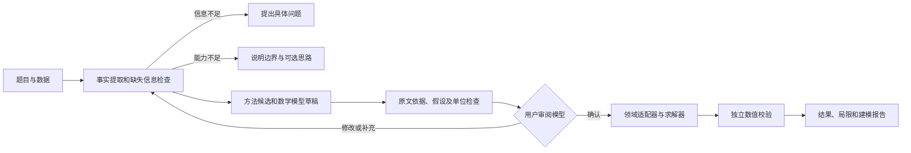

# 运筹优化数学建模 Agent 升级设计（评审稿）

## 目标与范围

用户给出自然语言问题和必要数据后，系统应能说明建模思路，形成可审阅的数学模型，求解，并报告模型与结果分别经过了哪些检验。本阶段聚焦员工排班、连续/混合整数线性规划和单商品整数最小费用流；其他数学建模类型仍可给出方法建议和所需数据，但不能声称已完成求解。

用户之前选择的“共享分析状态、固定领域草稿、领域求解器分流”继续作为基础。DeepSeek 负责理解与建议，已实现的 Python 领域适配器负责构造模型，OR-Tools 负责计算，独立校验器负责重算结果。

## 当前基线

- `analysis_agent.py` 使用一个固定结构的 `ProblemAnalysis` 返回状态、子任务及三种领域草稿；线性模型草稿逐变量记录连续、整数或二进制域。固定字段适应当前 DeepSeek 结构化输出的限制。
- `retriever.py` 从三层 HMML 方法库按关键词给候选方法打分；当前推荐只描述候选，不保证候选与求解器能力完全匹配。
- `cli.py` 在分析状态为 `ready` 时直接选择领域适配器并求解。它没有供用户审阅、修订和确认模型的独立步骤。
- `agent.py`、`linear_agent.py` 和 `min_cost_flow_agent.py` 分别编排方法检索、求解及独立结果校验；`evals.py` 又保留一套领域分流逻辑。
- 独立校验器可检查结构化模型下的约束和目标值，但不能证明该模型忠实于原题；求解器状态是最优性结论的主要依据。
- 当前隔离分支的 `evals/cases.json` 有 12 个案例，含连续 LP、整数 MILP、排班和网络流。默认 Evals 只校验案例文件，必须显式传入 `--live` 才调用 DeepSeek。README 和 HMML 说明仍包含过时的能力描述。

## 公开系统对照与取舍

| 系统 | 对本项目有用的做法 | 本期取舍 |
| --- | --- | --- |
| [MM-Agent](https://arxiv.org/html/2505.14148) | 分析、形式化、计算、报告四阶段；HMML 检索；子任务依赖及建模方案修订。 | 补齐形式化模型和报告。已有的子任务依赖先用于说明；执行多任务图留待有实际跨领域案例时实现。 |
| [OptiMUS-0.3](https://arxiv.org/html/2407.19633) | 将参数、变量、目标和每条约束分开处理；保存中间状态；允许用户审阅、修改；做针对性的单位和约束检查。 | 为每个约束记录原文依据、单位和确认状态；提供编辑与确认入口。暂不开放任意求解代码生成。 |
| [OptiGuide](https://arxiv.org/html/2307.03875) | 用求解器回答情景变化问题，再解释新旧结果差异；对查询和解释设置检查点。 | 先实现有证据的结果报告；情景重算列为后续功能。 |

这三项研究的目标和评测范围不同，不能直接比较论文中的成功率。本项目应以自己的标注案例检验需求提取、模型正确性和求解效果。

## 方案比较

1. **继续在 CLI 中逐项增加逻辑。** 最快，但三个领域已有重复编排，确认、报告和第四个领域会放大重复。
2. **立即把主流程迁入 LangChain/LangGraph。** 能表达状态和工具调用，但需要同时改造数据契约、流程与依赖，难以判断改进来自框架还是建模规则。
3. **保留领域核心，新增薄编排层与可审阅的模型工件。** 本期采用。先统一确认、领域分流、校验和报告；将 LangChain `create_agent` 作为隔离实验。确需跨进程暂停、恢复和长任务状态时，再引入 LangGraph。

## 核心流程

“信息充分”与“模型已被用户确认”是两个不同状态。`ready` 只表示草稿具备求解所需字段，不表示用户认可模型。

### 1. 可追溯的需求账本

每个事实记录稳定编号、原文片段或数据来源、值、单位及类别：原文明确给出、无损换算得出、待用户确认的假设。每个目标项和约束引用一个或多个事实编号。原文没有依据的数值或限制不得进入可确认模型。

对缺失信息保留部分事实与追问；不再因为某个领域草稿必须为空而丢失已知条件。发送给 DeepSeek 的三份固定形状草稿可以保持不变，需求账本作为后续内部工件和展示层。未来接收数据文件时，同时记录文件路径、版本或摘要，避免结果无法追溯到输入数据。

### 2. 建模方案与审批工件

`ModelDraft` 包含问题类别、变量及单位、目标方向与公式、逐条约束、明确假设、缺失项、候选方法与选择理由，以及它们的事实引用。该工件有版本号和内容摘要。用户编辑任何字段后，应重新校验，并对新版本重新确认。

命令行分为三种入口：

- `--request`：分析并输出建模思路和待确认草稿；缺失信息时输出追问。
- `--solve-draft <文件>`：用户审阅并提交结构化草稿后，重新校验该文件，执行求解与报告。命令调用本身代表用户对该文件版本的确认。
- `--preview`：可选的一次性探索求解，输出明确标记为“未经确认的预览结果”；不能把它标记成已确认的正式决策。

用户直接通过 `--input` 提供结构化问题时，按明确的结构化输入求解。现有 `--input` 只支持排班；第一阶段应让 LP 和网络流也经相同领域注册表读取和校验。模型返回的布尔值或 `ready` 状态不能充当用户确认。

### 3. 领域能力与求解器分流

建立一个领域注册表。每个适配器声明领域标识、支持的变量和约束、草稿校验、转换、求解、结果检查和报告字段。公共编排层负责状态、审阅和异常；领域代码继续决定数学模型与求解算法。

HMML 先给出候选方法，再由能力规则筛掉未实现或不匹配的方法。推荐结果可以展示“为什么合适”和“尚缺什么”；最终执行的求解器由经确认的模型类型和适配器能力决定。内部可使用领域特定类型，避免为了通用接口强行合并三种数学模型；DeepSeek 面向外部的固定 JSON Schema 保持兼容。

### 4. 分层验证和报告

1. **输入层：** 字段、引用、数值范围及单位检查。
2. **建模层：** 审查原题事实与变量、目标、约束的对应关系；自动规则标出遗漏和未经确认的假设，用户确认负责最终语义判断。
3. **结果层：** 独立重算约束余量、工时、流量平衡与目标值；区分可行、无解、无界、超时、仅有可行解和已证最优。
4. **报告层：** 逐项展示建模思路、公式、输入数据、方法选择、解、校验依据、未覆盖的条件及适用边界。文字解释只能引用模型和验证工件中的事实。

独立结果校验可证实解满足当前模型，不能单凭该校验证明模型正确或全局最优。最优性来自求解器状态、可获得的证书或额外交叉检查。无解时报告状态和可检查的瓶颈，不伪造方案。

## 评测设计

- 保留现有 11 例和当前离线、在线分层；先实际运行 `--request` 与各领域在线案例，记录模型名称、案例数、错误、延迟和结果，且不记录 API 密钥。
- 增加人工标注的“事实—参数—目标—约束”对照。分别衡量提取准确率、遗漏/编造约束率、单位错误、该追问时是否追问、领域分流、求解状态、结果校验和报告是否有依据。
- 每个已支持领域覆盖完整、缺失、超范围、无解及边界数据；加入同一题目不同表述和参数扰动。固定案例集比较升级前后表现，避免只看求解器测试通过率。
- LangChain 实验使用相同案例与 DeepSeek 模型，同当前直接 API 路径比较准确率、调用次数、耗时和失败形态。实验结果改善稳定后才决定是否接入主流程。

## 分阶段落地

### 第一阶段：可信的端到端最小闭环

修正 README 和 HMML 说明；加入需求依据、建模思路、明确的确认步骤和结果报告；消除 CLI/Evals 的重复分流。保持排班、LP、最小费用流现有求解器与校验器。验收时，对同一题能看到原题事实、数学模型、确认状态、求解状态及逐项验证，缺失或超范围问题不会被伪装成可行解。

### 第二阶段：扩展数学建模能力

已支持连续 LP 与混合整数/二进制线性模型：全连续变量使用 GLOP，包含离散变量时使用 SCIP，并由同一独立校验器重算约束、变量域和目标值。该后端选择遵循 [OR-Tools MIP 指南](https://developers.google.com/optimization/mip/mip_example)。下一步可增加有依据的情景重算和结果差异分析；多子任务 DAG 的执行在出现需串联不同领域结果的真实案例后实现。

### 第三阶段：框架实验和状态升级

做一个独立的 [LangChain `create_agent`](https://reference.langchain.com/python/langchain/agents/factory/create_agent) 工具选择实验，工具仅访问 HMML、能力说明和已确认的领域入口。待流程要求跨进程保存追问、审核与恢复状态时，再让 [LangGraph 中断与检查点](https://reference.langchain.com/python/langgraph/types/interrupt) 管理流程；OR-Tools 领域实现仍通过相同适配器调用。未来 Java/Spring AI 如需接入，使用稳定的 Python 建模服务接口。

## 可验收的代表场景

- **完整排班题：** 展示员工、班次、急救人数及最大工时各自来自哪段原文；确认后求得两个班次各至少一人、首班具备急救技能且每人不超时的解，并展示独立检查。
- **连续生产计划：** 展示变量、`max 40A + 30B`、`2A + B <= 100`、`A + B <= 80` 及非负条件；确认后得到 `A=20`、`B=60`、目标 `2600`，并重算约束和目标。
- **网络运输：** 展示节点供需、路线容量、费用和单位的原文依据；确认后给出路线流量、总成本、守恒与容量检查。
- **缺失或超范围：** 缺员工最大工时时提出追问；明确要求当前不支持的多商品流或 MILP 时说明边界，不返回伪解。
- **修订与预览：** 用户修改已确认草稿中的一条约束后，旧确认失效；预览求解的结果始终标记为未经确认。
- **真实综合题：** 以 [2026 年第十八届电工杯 A 题](2026-09-29-electric-cup-a-acceptance.md) 检验数据读取、多时段建模、24 场景求解、独立核验与完整报告。该题跨越多个实施阶段，只有五问逐项通过验收条件时才算整题通过。

## 暂不纳入本期的能力

自由生成并运行任意求解代码、广义非线性/随机规划、自动证明原文语义正确、没有用户确认的正式决策，以及不经领域验证就把知识候选方法标成可运行方法。遇到这类问题应说明建模思路、缺少的能力或数据，以及人工继续建模的路径。
